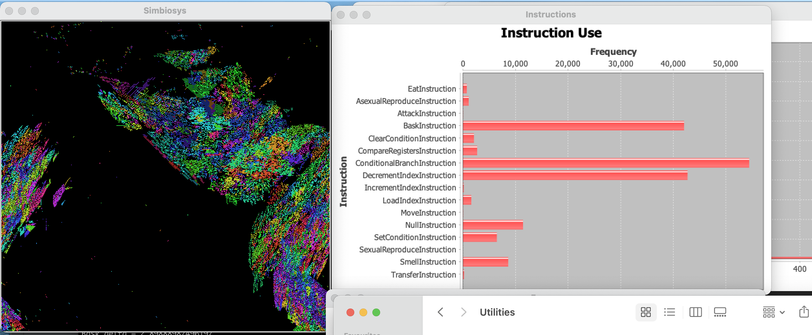

simbiosys
=========



SIMulation of BIOlogical SYStem is an Artificial Life program that simulates organisms using small virtual machines 
driven by programs are initially random, but that evolve by mutating and recombining in an open-ended way.  They 
exist on a two dimensional grid, like a cellular automata, and can move around, reproduce, transfer energy to/from
each other and sense their environment.  Energy is input into the system via a 'BASK' instruction that lets the 
Organism increase its energy store by an amount relative to the current seasonal conditions.  These conditions will
vary over time to apply some selective pressure to the world (weaker organisms will die off to make room for new 
offspring).  All other instructions will use some energy to execute, although actions like moving, reproducing, etc.
use comparatively more than sensing and looping.  

Various graphs appear when running to show average instruction
usage, age distribution, etc.  The hue of the pixels in the world view is a representation of the 'genome' of
the program - similar organisms genetically should have a similar hue.  The brightness of pixels is representative
of the energy levle of each organism, relative to the whole world maximum.

# Building
To build, you'll need Maven installed.  Then simply run:
```bash
mvn install
```
and any necessary dependencies will be downloaded and installed
# Running
To run the simulator, run:
```bash
mvn exec:java
```
and several windows should appear.  Sometimes the initial randomised set of organisms will all due off quickly.
If this happens, just quit and run it again.  Eventually a population should take off and reproduce, filling the
world.
